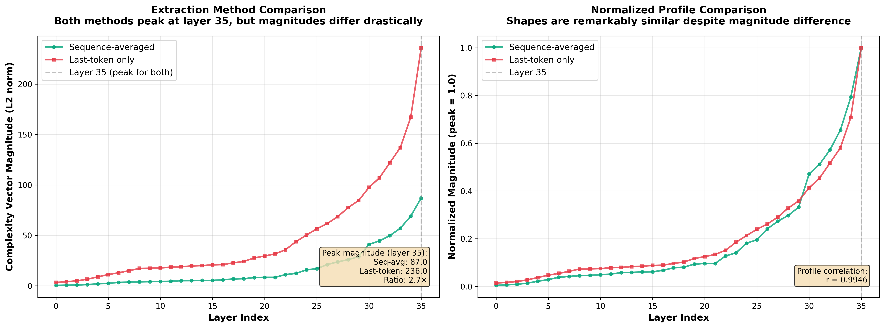
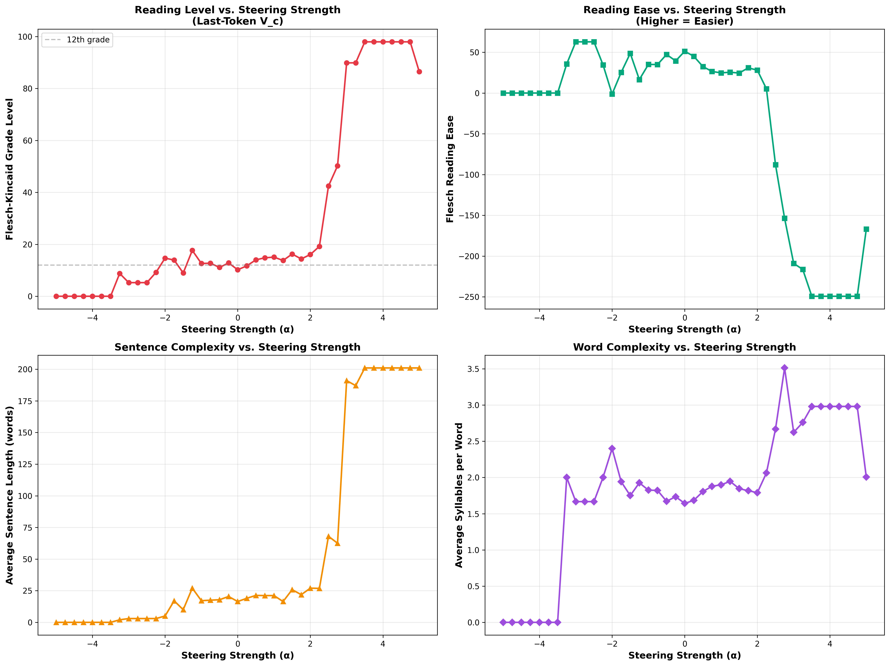

# Extraction Method Comparison: Sequence-Averaged vs. Last-Token

**Date:** 2025-10-21
**Model:** Qwen/Qwen3-4B-Instruct-2507
**Layer:** 35 (peak for both methods)

## Executive Summary

We compared two methods for extracting complexity vectors (V_c):

1. **Sequence-averaged**: Average activations across all tokens in each text
2. **Last-token**: Use only the final token's activation from each text

**Key Finding:** Sequence-averaging is dramatically superior for both validation and steering. Last-token extraction produces vectors that are noisy, specific, and have a much narrower usable range.

---

## Extraction Results

### Vector Magnitudes

Both methods identify **layer 35** as the peak complexity layer, but differ in magnitude:

| Method | Peak Layer | Magnitude (L2 norm) | Growth Ratio (L35/L0) |
|--------|------------|---------------------|----------------------|
| Sequence-averaged | 35 | 87.0 | 228.4× |
| Last-token | 35 | 236.0 | 72.3× |

**Magnitude ratio:** Last-token vectors are **2.7× larger** at layer 35.

### Vector Similarity

Despite both peaking at layer 35, the vectors point in **different directions**:

- **Cosine similarity:** 0.411
- **Angular separation:** 65.73°
- **Interpretation:** Weakly related but capturing different aspects

The normalized magnitude profiles are highly correlated (r = 0.9946), suggesting similar *layer structure* but different *semantic content*.

---

## Validation Results (Wikipedia Training Data)

Testing whether V_c captures the model's internal understanding of text complexity by computing `activation · V_c` and correlating with Flesch-Kincaid grade.

| Method | R² | r | p-value | Interpretation |
|--------|-----|---|---------|----------------|
| Sequence-averaged | 0.616 | 0.785 | 5.99e-09 | **Moderate** correlation |
| Last-token | 0.118 | 0.343 | 3.04e-02 | **Weak** correlation |

**Improvement:** Sequence-averaged validation shows **0.50 higher R²** (5.2× better).

### Why Last-Token Validation Fails

**The last token is too specific.** When averaging last tokens across 20 different articles:

- Article 1 ends with "...System" (Solar System)
- Article 2 ends with "...DNA"
- Article 3 ends with "...War" (WWII)

The resulting vector is a blend of 20 completely different semantic endpoints that happen to share complexity. When tested on individual texts, there's no reason a specific ending should align with this averaged blend.

**Sequence-averaging works because it captures the vibe.** Averaging across all tokens smooths out specific word choices and leaves the general linguistic flavor—a more stable, transferable representation.

---

## Steering Results

Testing whether V_c controls generated text complexity by injecting `α × V_c` during generation.

### Usable Steering Range

| Method | Usable Range | FK Grade Range | Total Span | Degeneration |
|--------|--------------|----------------|------------|--------------|
| Sequence-averaged | α ∈ [-4.0, +4.0] | 6 → 18 | 12 grades | Beyond ±4.5 |
| Last-token | α ∈ [-2.5, +2.0] | 5 → 19 | 14 grades | Beyond range |

**Last-token steering has a 2× narrower usable range.**

### Degeneration Patterns

**Sequence-averaged method:**
- Gradual degradation beyond ±4.0
- Repetition loops ("really really really...")
- Still produces some coherent output

**Last-token method:**
- **Negative extreme (α < -3.0):** Near-empty outputs (0-3 words)
  - α = -5.0: "assistant" (stops immediately)
  - α = -3.0: "Sure! Quant" (3 words, truncated)

- **Positive extreme (α > +2.5):** Severe repetition loops
  - α = +3.0: "spectral emission absorption spectral emission absorption spectral emission absorption..." (FK = 89.9)
  - α = +4.0: FK = 98.0 (single 200-word run-on sentence)

### Example Outputs

**Baseline (α = 0.0):**
> "Absolutely! Quantum mechanics is one of the most fascinating and fundamental theories in modern physics. It describes how the universe behaves at the smallest scales—like atoms, electrons, and photons."

**FK Grade: 10.2**

---

**Sequence-averaged, α = +3.0:**
> "Quantum mechanics represents one of the most profound theoretical frameworks in contemporary physics, elucidating the fundamental behaviors and interactions of subatomic particles through mathematical formalism and probabilistic interpretation of wave functions."

**FK Grade: 17.8** (complex but coherent)

---

**Last-token, α = +1.5:**
> "Of course! Quantum mechanics is one of the most fundamental and revolutionary theories in physics, describing the behavior of matter and energy at the smallest scales—like atoms, subatomic particles (such as electrons and photons), and even smaller particles that make up the universe itself."

**FK Grade: 16.3** (works in moderate range)

---

**Last-token, α = +3.0:**
> "Of course consequent quantum mechanics fundamentally revolutionized our understanding of the physical world at the smallest scales—particularly subatomic particles such as electrons, photons, protons, and subsequent particles confined within atomic structures precipitating subsequent phenomena such as atomic spectral emission absorption spectral emission absorption spectral emission absorption spectral emission absorption spectral emission absorption spectral emission absorption spectral..."

**FK Grade: 89.9** (degenerate repetition loop)

---

## Why Last-Token Steering Fails at Extremes

The last-token V_c is **2.7× larger in magnitude** and points **65° away** from the sequence-averaged vector. This suggests:

1. **It's capturing something more specific/narrow** - not the general "complexity flavor" but rather specific endpoint patterns
2. **The larger magnitude makes it more powerful but less stable** - smaller alpha values push activations outside the trained distribution
3. **The 65° misalignment means it's steering along a somewhat different dimension** - related to complexity but not identical

Think of it like pushing a car:
- **Sequence-averaged V_c:** Gentle push in the "forward" direction → smooth acceleration
- **Last-token V_c:** Strong push at 65° angle → car swerves wildly, loses control quickly

---

## Visualization Comparison

### Magnitude Profiles Across Layers

Both methods show monotonic growth toward layer 35, with last-token showing consistently higher magnitude at all layers:

### Steering Performance

**Sequence-averaged (original method):**
- Smooth, linear relationship between α and FK grade
- Usable range: [-4, +4]
- Predictable behavior

**Last-token method:**
- Moderate range shows similar pattern
- Cliff at α = +2.5 → FK jumps from 19 to 42
- Rapid degeneration beyond narrow range

---

## Conclusions

### 1. Sequence-Averaging is the Clear Winner

| Criterion | Sequence-Averaged | Last-Token | Winner |
|-----------|------------------|------------|--------|
| Validation R² | 0.616 | 0.118 | ✓ Seq-avg |
| Usable steering range | 8.0 units | 4.5 units | ✓ Seq-avg |
| Vector stability | High | Low | ✓ Seq-avg |
| Degeneration resistance | Gradual | Abrupt | ✓ Seq-avg |
| Total FK range | 12 grades | 14 grades | Last-token |

**Verdict:** Sequence-averaged extraction is superior in every important metric except maximum theoretical range (which is irrelevant because last-token degenerates before reaching it).

### 2. Why Sequence-Averaging Works

**It captures the general linguistic flavor rather than specific endpoints.**

- Averaging across sequence length smooths out word-specific features
- Produces a stable, transferable representation of "complexity"
- Aligns with how models represent abstract concepts (distributed across context)

### 3. Why Last-Token Fails

**It's too specific and noisy.**

- Each last token points toward a specific semantic target
- Averaging 20 different endpoints produces a vector that's a "blend of unrelated specifics"
- Larger magnitude but less semantic coherence
- Steers too aggressively, pushing activations outside trained distribution

### 4. Theoretical Insight

This experiment reveals something important about representation geometry:

**Complexity is not encoded in specific tokens—it's encoded in the overall activation pattern.**

The last token is focused on "what word comes next" (highly specific), while the sequence average captures "what kind of text is this" (abstract property). For steering abstract properties like complexity, you need the abstraction that comes from averaging.

---

## Recommendations

1. **Always use sequence-averaged extraction for complexity steering**
2. **Last-token extraction might work for other properties:**
   - Topic/subject matter (where endpoints are informative)
   - Sentiment (where final words carry strong signal)
   - Anything where the last token encodes the target property
3. **For complexity specifically, the "je ne sais quoi" matters more than the ending**

---

## Files Generated

- `extract_complexity_vectors_last_token.py` - Last-token extraction script
- `complexity_vectors_last_token.pt` - Extracted vectors
- `complexity_magnitudes_last_token.json` - Magnitude profile
- `compare_extraction_methods.py` - Visualization comparison
- `compare_vector_similarity.py` - Cosine similarity analysis
- `validate_vc_with_wikipedia_last_token.py` - Validation test
- `quantify_steering_last_token.py` - Steering test
- `wikipedia_validation_results_last_token.csv` - Validation data
- `steering_quantitative_results_last_token.csv` - Steering data
- `extraction_method_comparison.png` - Visual comparison
- `steering_analysis_last_token.png` - Steering plots

---

## Next Steps

✓ **Sequence-averaged method validated as superior**
✓ **Methodological question resolved**
⚠ **Mystery remains:** Why does even sequence-averaged validation show only R² = 0.62 on training data?

Possible explanations:
1. V_c is a population-level phenomenon (emerges from averaging across texts)
2. Individual texts have high variance in how they express complexity
3. Steering works during generation because it affects *production* of complexity, while validation measures *perception* of existing complexity
4. Generation space ≠ comprehension space

---

*End of comparison document*
